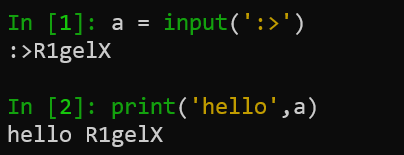
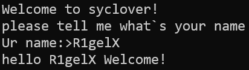

# 第二章 python基础语法

## 基础语法与运算符

### 基础语法
#### 第一个程序
要理解Python的基础语法，我们可以打开VSC查看这个简单的介绍程序
```python
message = "Hello,This is Syclover" # 对变量赋值
print(message)#打印变量
```
这就是一个简单的Python程序，与其他语言不同，它不需要写一些特殊的include int main，class之类的，只需要一行一行写代码就行。
Python也不需要声明变量，每一个“变量”可以称为一个name，它的值其实都是一个Object。
##### 单行语句
Python可以把代码写在一行，可以看到上面，Python没有了很多语言需要的分号";",但分号其实在Python里可以使用，上述代码我们可以写成
```Python
message = "Hello,This is Syclover";print(message)
```
##### 多行语句
那么一行写不下咋办（指看起来太长），类似Linux的命令行，我们可以用  \  来拼接一些较长的运算式子.
#### 标识符
标识符由字母、数字、下划线组成，但不能以数字开头，且区分大小写。
而对于下划线开头的，是有特殊含义的，再之后面向对象里会遇到。
例如：
1. \_foo 是不可直接访问的类属性，只能通过接口访问，不能被import。
2. \_\_foo是类的私有成员 
3. \_\_foo\_\_是Python里特殊方法的专用的标识，或者是内置变量例如 
 \_\_name\_\_ ，代表当前所在模块的模块名

Python有一些保留字符是不能用作标识符的，例如class def for if import等

#### 缩进
Python与其他语言不同，它不需要 {} 来控制代码的范围，那么怎么标识所属关系呢？Python利用了缩进来控制
```Python
if True:
	print("缩进一个tab")
	if True：
		print("缩进两个tab")
```
可以很明显的看出，缩进的关系，需要注意的是，在缩进之前，语句后都有一个 “:”

关于缩进，我们可以使用：
1. 两个空格
2. 四个空格
3. 一个制表符
```Python
if True:
  print("right")
  print("none")
```
等效
```Python
if True:
	print("right")
	print("none")
```
虽然这三种缩进方式在Python中都是合法的，但是不能在同一份代码中混用。

### 运算符

##### 算数运算符
除了基本的 + - \* / 以外，还有 % (模)，** (幂) //(整除)
注意 python里不支持 i++ 这种写法

##### 比较运算符
== 比较对象是否相等
!= 比较对象是否不相等
<> 不等于（在本教程的的Python3里已经弃用了（
<  > 大小与
<= >= 小于等于 大于等于

##### 赋值
一个简单的赋值
`a = 1`
多个变量的赋值
统一赋值：`a = b = c = 1`
分别赋值：`a, b, c = 1,"a",[1]`

##### 赋值运算符
-  += : c += a => c = c +a
-    -=: c -= a  => c = c - a 
-    \*=: c \*= a  => c = c \* a
-    /=: c /= a  => c = c / a 
-  %=: c %= a => c = c% a 
-  \*\*=: c \*\*=a => c = c \*\* a
-  //=: c //= a => c=c //= a

##### 位运算
- & 按位与，   0000 & 1010 = 0000    1001 & 1010 = 1100
- |   按位或，   0011 & 1101 = 1111     1001 & 1010 = 1011
- ^ 按位异或，0011 & 1101 = 1110     1001 & 1010 = 0011
- ~ 按位取反，~0011 = 1100 
- `<<` 左移        1010 << 2 = 1000
- `>>` 右移        1010 >> 2 = 0010

##### 逻辑运算符
and 布尔与，两个表达式均成立则为True
or    布尔或，两个表达式至少有一个成立为True
not   布尔非，表达式为false返回True

##### 成员运算符
in 和 not in,指 判断一个值是否在/不在另一个序列里

## 基本数据类型
1. Numbers
2. String
3. List
4. Tuple
5. Dictionary

```python
a = 1 # Number
b = "abc" # String
c = [1,2,a,b] # List
d = ('abc','123',123) # Tuple
e = {"name":"Rxxxx","age":100} # Dictionary
```

## 输入输出与注释
### 输出
在Python中，输出语句就是print()函数
其语法如下：
`print (value,...,sep='',end='\n',file=sys.stdout,flush=False)`
#### value
其中value可以有多个值或者变量。
#### sep
sep使用分隔多个变量的，如果我们想要在每一个值输出后添加一个";"那我们可以使用 print(a,b,c,sep=';')
#### end
默认情况下print是不需要手动输入一个`\n`来换行的因为，end参数默认是`\n`所以每次print都是新的一行，如果我们需要将每次print的内容连接起来，就使用print(a,end="")
#### file
file参数指定print函数的内容输出的目标，默认是sys.stdout也就是系统标准输出，就是屏幕。那么可以更改file为一个打开的文件
```Python
f = open("congif.txt",'w')
print("name:Rxxxx",file=f)
f.close()
```

#### flush
print函数会将内容放进内存里，那么这个内容可能无法及时的输出到指定的输出目标，那么这个时候设置flush为True（默认是false），print结束后，内容会立即输出到目标。
例如这个例子
```Python
import time
for i in range(10):
	print('.',end = '')
	time.sleep(1)
```
你觉得这个代码的效果是什么，依此出现10个点？错了，他是先执行sleep，当最后一个print执行完，才会显示全部的内容。除非这里不去修改end。
那么这个时候我们就可以利用flush，把这个参数设置为True
```Python
import time
for i in range(10):
	print('.',end = '',flush=True)
	time.sleep(1)
```

### 输入
#### 命令行读取
可以采取input接受，同时input也可以输出一些自定义字符来提示用户输入
```python
a = input(':>')#会先输出 :> 然后等待用户输入
```

#### 文件读取
Python里打开文件操作一般两种写法
```Python
# 1
f = open('file.txt','r')
data = f.read()
f.close()
# 2
with open('file.txt','r') as f:
	data = f.read()
# 不需要手动close
```
### 注释

```python
#  单行注释
'''
多行注释
123
'''
"""
多行注释
123
123
"""
```

## 练习
学完了基础语法，就可以实现简单的输入输出了，那么尝试用简单的print和input来实现下图所示功能
其中R1gelX为输入

