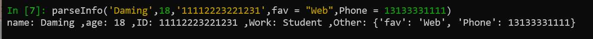
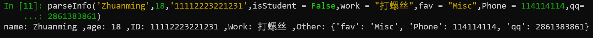

# 第五章 python函数
函数是组织好的，可重复使用的，用来实现单一，或相关联功能的代码段。

函数能提高应用的模块性，和代码的重复利用率。你已经知道Python提供了许多内建函数，比如print()。但你也可以自己创建函数，这被叫做用户自定义函数。
### 定义
#### def关键字定义
在python里，定义一个函数使用def关键字开头，然后是函数名，例如`def submit(s):`。在函数内可以使用return来结束函数，并且可以选择性的返回一个值给调用者，例如`result = submite(s)`  这样，函数的返回值将保存在result里
#### 匿名函数
还有另一种方式来定义函数，就是**匿名函数**
可以使用 lambda来定义一个匿名函数，语法是`lambda [arg1 [,arg2,.....argn]]:expression`
例如：

### 参数
在定义函数的时候，括号内需要放入参数变量，参数除了上述一个简单s，以外还有其他的定义方式
1. 必选参数，`hello(s)`  其中s必须传入
2. 默认参数，放在必选参数后，`hello(s,n = 3)`，这是默认参数，不传入n的值的时候，则是默认的3
3. 可变参数，即是参数的个数不确定，可以传入任意数量的参数`hello(*s)` 
4. 关键字参数，允许传入任意个含参数名称的参数，这些参数按参数名和参数值在函数内自动以键值对的方式组成dict，可以`hello(s,**r)`这样来定义r这个关键字参数，也可以使用`hello(s,*,name,work)`来限定只能输入name和work参数

注意，定义函数的参数顺序，需依此是必选参数，默认参数，可变参数，关键字参数

## 练习
尝试写出满足下图效果的parseInfo函数


需要用到必选参数，默认参数，和关键字参数，函数内需要用到控制语句以及对字典的操作
测试参数
```
'Daming',18,'11112223221231',fav = "Web",Phone = 13133331111

'Zhuanming',18,'11112223221231',isStudent = False,work = "打螺丝",fav = "Misc",Phone = 114114114,qq=2861383861
```