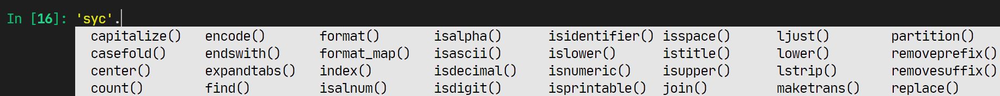

# Python类的魔术方法

什么是魔术方法？其实你已经见过了，就是类里面用双下划线`__`包裹在两侧的方法，比如构造函数：`__init__`。

双下划线是怎么回事？又要拉出来Java比较一下了，Java中是有专门的关键字（`public`, `private`, `protected`）来控制一个方法的可见性的，可以控制方法是否对外可见，能不能被在外部进行调用。

但是Python并没有严格的访问控制，而是以单下划线，双下划线等形式，来限制访问。比如你在IPython中，按Tab的代码提示，可以看到全都不是下划线开头的方法。


可实际上一个类可不止这些方法，使用`dir()`可以看到一个对象的真实面貌，比如下面我们定义一个空的类，实际上都已经有很多默认存在的
不可见属性了：

```python
In [7]: class A:
   ...:     pass
   ...:

In [8]: dir(A)
Out[8]:
['__class__',
 '__delattr__',
 '__dict__',
 '__dir__',
 '__doc__',
 '__eq__',
 '__format__',
 '__ge__',
 '__getattribute__',
 '__gt__',
 '__hash__',
 '__init__',
 '__init_subclass__',
 '__le__',
 '__lt__',
 '__module__',
 '__ne__',
 '__new__',
 '__reduce__',
 '__reduce_ex__',
 '__repr__',
 '__setattr__',
 '__sizeof__',
 '__str__',
 '__subclasshook__',
 '__weakref__']
```


魔术方法是怎么调用的呢？

普通的方法需要`对象.方法()`进行调用，而魔术方法则是以各种特殊的形式进行调用的，比如for循环，运算符之类的。


## 编写魔术方法

来点例子：
```python
class Vector:
    def __init__(self, x=0, y=0):
        self.x = x
        self.y = y

    def __repr__(self):
        """ 定义了REPL中回显的格式 """
        return f'[{self.x} {self.y}]'
    
    def __str__(self):
        """ 定义了调用str()转换成字符串时的格式，和回显的格式一致 """
        return __repr__(self)
        
    def __add__(self, vec):
        """ 定义了 + 运算符时候的操作 """
        self.x += vec.x
        self.y += vec.y
        return self
```

试试看
```python
v = Vector(1, 0) + Vector(0, 1)
print(v)
```

当然还有其他的，比如

* 定义`__iadd__`可以实现`+=`运算符

* 定义`__iter__`实现在比如`for i in x`的迭代中使用

* ...


## 作业

1. 按照你自己的想法，丰富`Vector`类的功能，比如实现向量的大小比较，实现向量乘法等

2. 尝试实现对`__new__`之类的方法的重载，实现在创建和销毁对象时，打印日志

3. 自行了解常见魔术方法的作用