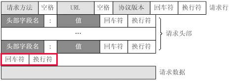

# 解析POST HTTP请求

在上一节课程中，我们完成了对GET型HTTP请求的解析，接下来我们将继续增大难度，完成对POST(application/x-www-form-urlencoded)型请求的解析!

## POST请求格式

一个POST请求报文的一般格式如下:



</br>


一个简单的POST请求示例是:

```text
POST /post HTTP/1.1\r\n
Cookie: test=true; key=value\r\n
Content-Length: 7\r\n
Content-Type: application/x-www-form-urlencoded; charset=utf-8\r\n
Host: localhost\r\n
\r\n
a=1&b=2
```

注意，上面为了能看的更清楚，我们将看不见的`\r\n`也写了出来。

可以看到POST请求和GET请求在大体上是类似的，例如它们第一行都由请求方法，URL，HTTP协议版本组成，接下来的几行是请求头，GET参数与POST参数的格式相同等。

POST请求与GET请求最大的不同有以下几点:

- 请求方法为POST而非GET
- 存在特殊的请求头(Content-Length,Content-Type)
- 在两个`\r\n`之后紧跟着是请求正文(a=1&b=2),而且其长度一般与Content-Length相等，若Content-Length较大，则服务端认为请求未发送完毕，不会返回响应，若Content-Length较小，则服务端可能会将请求正文做截断处理。


同样的，我们可以使用python的socket模块进行发包，与上一节课程类似，这里就不再做演示了。


## 作业

我们为`code/11/request.py`中的`analysis_request`方法添加一个默认参数:`update_content_length=True`,这个参数的作用为是否自动更新Content-Length，整个函数的定义变成了:

```python3
def analysis_request(raw_data, update_content_length=True):
    # 解释成功则返回一个PreparedRequest实例，记得调用prepare方法来设置其属性
    # 解析失败则 raise AnalysisError()
    ...
```


接下来是你的表演时间!修改`code/11/request.py`中的`analysis_request`方法，增加对Content-Type为application/x-www-form-urlencoded的POST请求支持(允许导入标准库，不允许导入第三方库)，并运行`python3 code/11/tests/test_post.py`，确保所有测试样例都顺利通过!

需要注意的问题:

- 畸形POST请求如何处理
- 新参数update_content_length如何处理
- Content-Length非法如何处理

PS:

- `PreparedRequest`的`prepare`方法中请传入bytes类型的body(因为测试样例中的判断是以bytes类型进行判断的)

- 所有测试样例通过的输出如下:

  ```text
  ...........
  ----------------------------------------------------------------------
  Ran 11 tests in 0.002s
  
  OK
  ```

  

