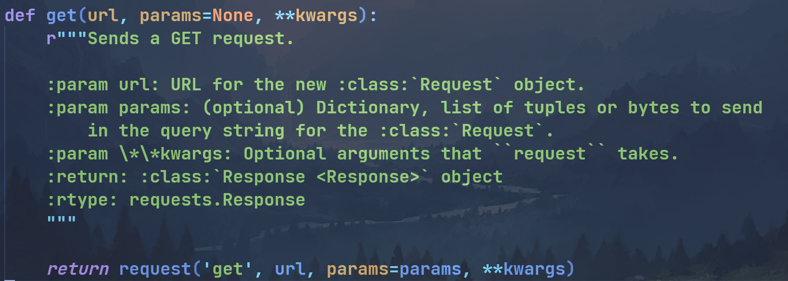

# 实现MyRequests: 发送请求与接收响应

现在，一切准备得差不多了，是时候检验我们的成果了!让我们一起来编写myrequest.py，来实现requests!


## request函数

我们知道，requests库中的request函数是其主要的函数，实际上get函数和post函数只是其的偏函数，例如:




所以我们首先需要实现的是request函数，先前我们PreparedRequest类写的如此复杂，就是为了此刻准备!

首先，我们从以前的代码中引入一些需要使用的类和函数:

```python3
import socket
import ssl
import json
from request import analysis_request, PreparedRequest, File
from response import analysis_response, Response
```


然后，我们要去实现`request`函数，从kwargs中获取一些参数，然后传入prepare方法，注意这里需要设置update为True，即需要根据设置的参数来更新关联的其他参数(比如设置了params，需要更新url):

```python3
def request(method, url, **kwargs) -> Response:
    req = PreparedRequest()
    method = method.upper()
    params = kwargs.get("params", dict())
    headers = kwargs.get("headers", dict())
    cookies = kwargs.get("cookies", dict())
    body = kwargs.get("data", b"")
    json_data = kwargs.get("json", dict())
    if json and not body:
        body = json.dumps(json_data).encode()
    files = kwargs.get("files", None)
    req.prepare(method, url, "HTTP/1.1", headers, cookies, params, body, files, update=True)
    
```

最后是要去调用我们待会作业中的`_send`函数，拿到原始的响应报文，调用`analysis_response`方法解析并返回解析后的响应实例:

```python3
    # print(req.to_raw().decode())
    raw_response = _send(req)
    resp = analysis_response(raw_response)
    resp.setRequest(req)
    # print(raw_response.decode())
    return resp
```


等下，难道request就这么简单吗？

实际上我们需要对某些参数进行特殊处理，比如`files`，在之前的课程中我们知道files需要传入一个元素都是`Files`对象的tuple/list，但在requests库中，files实际上传入的是一个dict，key为post表单的名字，value可以是bytes,str,或者一个tuple，例如:

```python3
files={"file": "some text"}
files={"file": b"some text"}
files={"file": ("filename", b"some text", "plain/text")}
files={"file": (("filename1", b"some text1", "plain/text"), ("filename2", b"some text2", "plain/text"))}
```

为了支持这样的传参，我们需要对传入的files进行处理:

```python3
    filedicts: dict = kwargs.get("files", {})
    files = None
    if filedicts:
        files = []

    for name, v in filedicts.items():
        if isinstance(v, str):
            files.append(File(name, "", "", v.encode()))
        elif isinstance(v, bytes):
            files.append(File(name, "", "", v))
        elif isinstance(v, (tuple, list)):
            filelist = []
            if isinstance(v[0], (tuple, list)):
                filelist.extend(v)
            else:
                filelist.append(v)

            for filedata in filelist:
                filename = filedata[0]
                data = filedata[1]
                if isinstance(data, str):
                    data = data.encode()
                elif hasattr(data, "read"):
                    data = data.read()

                content_type = ""
                if len(filedata) > 2:
                    content_type = filedata[2]

                files.append(File(name, filename, content_type, data))
```


实际上我们还有一个棘手的地方需要处理，即补充一个特殊的请求头: `Connection`。我们强制让这个请求头的值为`close`，这个意思即当服务器接受请求，发送完响应之后就断开socket，这样可以避免客户端一直在等待响应的情况(因为客户端不知道什么时候响应接收完毕)。

```python3
# 在body = kwargs.get("data", b"")行下增加
for k, v in headers.items():
    if k.upper() == "CONNECTION":
            headers[k] = "close"
            break
    else:
        headers["Connection"] = "close"
```


## request_raw函数

对于这个函数，我们就比较好实现了，它接收一个bytes类型的`raw_request`参数，返回一个`Response`实例。当然，我们还是要用一些比较丑陋的代码处理一下Connection请求头的问题。

```python3
def request_raw(raw_request: bytes) -> Response:
    raw_request = raw_request.replace(b"\n", b"\r\n") # 这里将\n换成\r\n，方便使用
    req = analysis_request(raw_request)
    data_list = raw_request.split(b"\r\n")
    splitLines = 0
    for n, line in enumerate(data_list):
        if line == b"":
            splitLines = n
            break

    for n, line in enumerate(data_list[1:splitLines]):
        if line.upper().startswith(b"CONNECTION"):
            break
    else:
        data_list.insert(1, b"Connection: close")

    raw_request = b"\r\n".join(data_list)
    # print(raw_request.decode())
    raw_response = _send(req, raw_request)
    resp = analysis_response(raw_response)
    resp.setRequest(req)
    # print(raw_response.decode())
    return resp
```


一个使用request_raw的例子是:

```python3
request_raw(b"""GET /get?a=B&c=D HTTP/1.1
CustomHeader: AAA
Host: httpbin.org:80

""")
```


## get函数与post函数

这两个函数实际上就是requests的偏函数，几乎可以照搬requests库:

```python3
def get(url, params=dict(), **kwargs) -> Response:
    return request('get', url, params=params, **kwargs)


def post(url, data=b"", json=None, **kwargs) -> Response:
    return request('post', url, data=data, json=json, **kwargs)
```


## 作业

接下来是你的表演时间!在`code/11/request.py`中实现`_send`函数(允许导入标准库，不允许导入第三方库)，这个函数的作用接收`PreparedRequest`实例和原始请求报文(可选)，发送请求并返回服务器的原始响应报文。

接下来几个点可以帮助你完成作业:

- 使用`isinstance`函数判断参数类型

- `PreparedRequest`的`to_raw`方法可以返回请求的原始报文
- `PreparedRequest`的`host`和`port`属性可以分别获取请求的主机名和端口
- 使用自带的`ssl`库解决发送https请求的问题
- 使用`socket.sendall`方法确保请求发出
- 使用`socket.settimeout`方法和try-except语句来设置socket超时时间
- 使用`while`语句确保所有响应报文都已经接收
- 别忘了调用`socket.close`方法关闭socket


运行`python3 code/11/tests/test_send.py`，确保所有测试样例都顺利通过!

PS: 所有测试样例通过的输出如下:

```
.
----------------------------------------------------------------------
Ran 1 tests in 0.001s

OK
```

