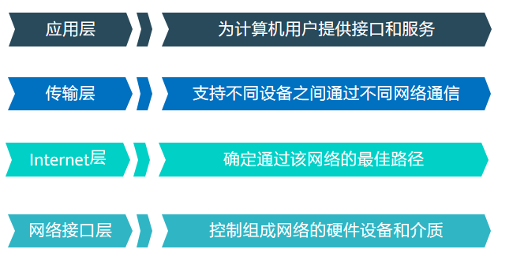
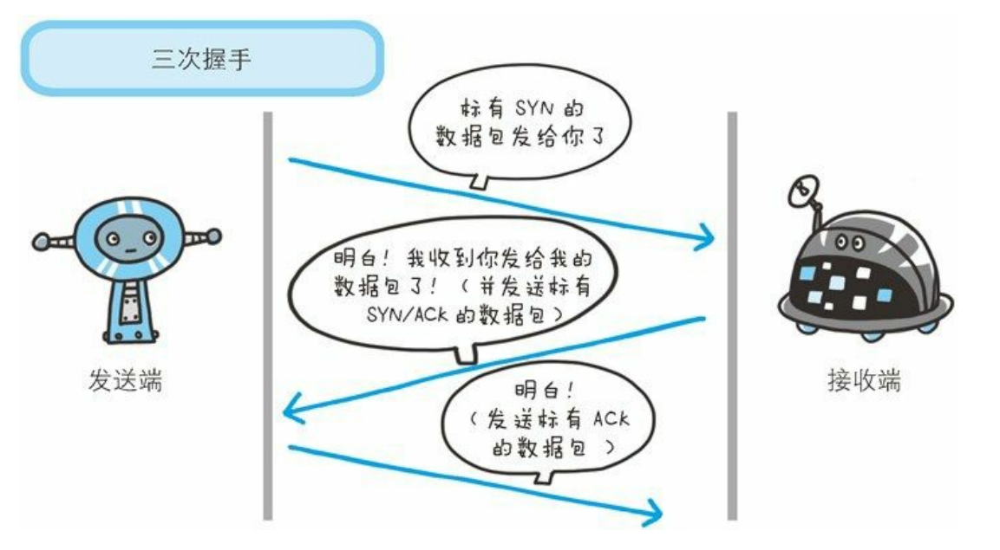
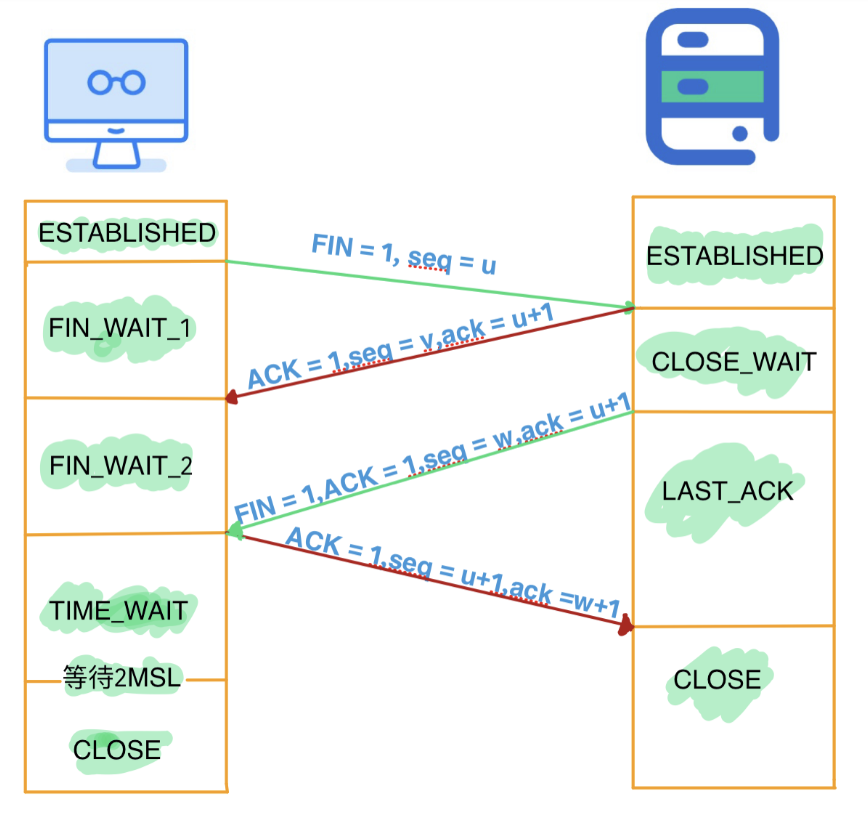

# 第六章 TCP
## TCP/IP四层模型

Internet层一般也叫网络层，网络接口层一般也叫做数据链路层。每个层级的负责点不同，通信数据会从网络接口层进行传输，从数据的封装上看，相同层级是完全对应的，哪一层负责封装，哪一层就负责解析。
### 网络接口层
#### 作用
1. 实现网卡接口的网络驱动，处理数据以在以太网等物理媒介的传输
2. 网络驱动去适配了不同传输媒介的特性，向上层提供了一个统一的接口，例如我们的以太网接口，WIFI网卡，光纤接口等，其相应的设备驱动分别将电缆中的电信号，空气中的无线电信号以及光缆中的光信号进行接受处理，解析为统一标准的数据格式，以便上层协议解析

#### 协议
ARP和RARP协议是工作在数据链路层的协议，其作用是实现IP和MAC地址之间的转换

### 网络层
#### 作用
因为Internet是全球互联网，这是一个庞大的网络，是由很多个局域网和广域网组成的集合。通常情况下我们通信双方的主机，是位于不同的局域网络，那么我们建立连接会通过很多中间节点的转发，我们称之为路由器，那么如何在确定数据包在网络中的路径，这就是网络层的作用
1. 网络层的任务之一就是选择这些中间节点，以确定两台主机间的（最佳）通讯路径。
2. 其次，网络层实现了网络路径的选择，向上层协议隐藏了整个数据包流通的复杂过程，因此在上层看来，数据包时直接连接到接收方的。
#### 协议
1. IP协议：IP协议(Internet Protocol)是网络层最核心的协议，它根据数据包的目的IP地址来决定如何投递该数据包。若数据包不可直接发送给目标主机，那么IP协议就为它寻找一个合适的下一跳路由器，并将数据包交付给该路由器去转发，如此循环直至到达目标主机或者发送失败而丢弃该数据包。在网络拓扑中会使用最小生成树算法去确定一个最短路径
2. ICMP协议: ICMP协议(Internet Control Message Protocol，因特网控制报文协议)是IP协议的补充。其作用是用于检测网络的连接状态，反映网络通路的情况，例如我们常用的ping，traceroute(tracert)命令，就是利用的ICMP协议。

### 传输层
#### 作用
传输层对上层应用，对处于网络连接中的两台设备提供数据传输。
#### 协议
传输层主要有两个协议，TCP（传输控制协议）和UDP（数据报协议）。TCP后面会单独的说明，这里就重点介绍一下UDP。
UDP是一个不可靠的协议，也是一个无连接的协议。无连接: 

>通讯双方不保持一个长久的联系，因此应用程序每次发送数据都要明确指定接收方的地址；
 基于数据报的服务: 这是相对于数据流而言的，每个UDP数据报都有一个长度，接收端必须以该长度为最小单位将其内容一次性读出，否则数据将被截断。
 UDP不具有发送时是被重发功能，所以UDP协议在内核实现中无需为应用程序的数据保存副本，当UDP数据报被成功发送之后，UDP内核缓冲区中该数据报就被丢弃了。

那么UDP的利用，例如VOIP服务，也就是基于互联网的语音通话，如果使用TCP，可能会增加延迟，并且等待重传可能导致音频连续性出现问题，所以不如承担一定的丢包风险。包括我们的在线游戏，以及DNS服务均是基于UDP的。

### 应用层
#### 作用
决定了向用户提供应用服务时通信的活动。因为前三层完成了数据的封装和传输，这一层只需要面向用户提供高效的稳定的服务，通常是处理各种业务逻辑，例如文件传输，网络管理。
#### 协议
FTP文件传输协议，DNS域名系统，HTTP超文本传输协议均是应用层协议。

## TCP协议介绍
在上诉的四层模型里，TCP协议就是工作在传输层的协议。它的存在是为了提供一个可靠的的字节流服务。

### 字节流服务
TCP是面向字节流的，TCP把应用层传过来的数据当作一连串的字节流，所谓的字节流服务就是把这些大块的传输数据分割成报文段为单位的数据包进行管理
### 可靠性
TCP依靠校验和，序列号，确认应答等机制保证了可靠性
1. 校验和，在数据传输的过程中，将发送的数据段都当做一个16位的整数。将这些整数加起来。并且前面的进位不能丢弃，补在后面，最后取反，得到校验和。
2. 序列号，TCP传输时将每个字节的数据都进行了编号，这就是序列号。在接收方收到了数据后，会进行应答，也就是ACK报文，ACK中带有确认序列号，告诉发送方接受到了哪些数据
3. 超时重传，在进行TCP传输时，由于确认应答与序列号机制，也就是说发送方发送一部分数据后，都会等待接收方发送的ACK报文，并解析ACK报文，判断数据是否传输成功。如果没有接收到相应的报文，说明可能因为网络原因丢包，数据包发送失败，或者是响应ACK报文发送失败。这个时候就需要超时重传，如果在一定时间内，没有收到相应ACK，那么会将数据重新发送一次
4. 连接管理,指三次握手，四次挥手
还有利用滑动窗口的流量控制，和数据包发送的拥塞控制，避免突然的传输大量数据导致网络问题。
###  三次握手
为了把每个数据包准确无误的送到指定的地方，TCP采用了三次握手来建立连接。
1. 发送一个SYN数据包给接收端
2. 接收端返回一个SYN/ACK的数据包
3. 发送端在返回ACK的数据包
至此，建立连接成功

### 四次挥手
TCP在数据传输完成后，会利用四次挥手去结束连接

### Wireshark抓包分析
下载一个工具Wireshark吧
打开工具选择一个网卡抓包，根据自己的实际情况选择WLAN或者以太网，然后打开浏览器访问http://httpbin.org
怎么判断是访问这个网站的流量呢，wireshark里写的都是通信的IP
我么可以通过httpbin.org去进行查询IP

在流量包里
因为通信是双向的，我们可以通过`ip.src == 3.94.154.124 || ip.dst == 3.94.154.124`进行过滤
分析：
如下

刚开始本地向目标发送SYN包，接着当目标收到后，给我们返回SYN,ACK，当我们收到SYN,ACK我们就发送ACK进行确认，接着就开始正式的HTTP请求

## 作业
看了上面的概念是不是还是感觉一头雾水。
那么根据上述抓包分析部分，自己下载wireshark来尝试一下，也可以学习一些其他追踪TCP流的操作，查看TCP流中的HTTP请求与响应数据，下一节内容，也可以结合这个进行学习和分析。