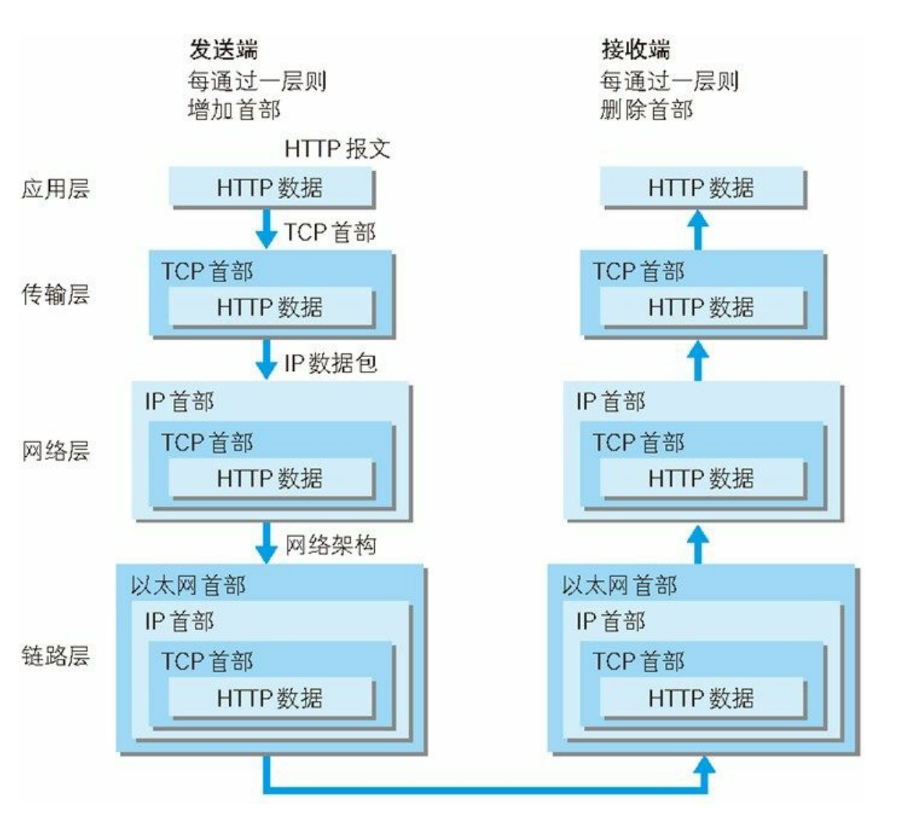

# HTTP
## HTTP协议介绍
HTTP协议（超文本传输协议），是一种传输超媒体文档的应用层协议，是web客户端和服务端沟通的桥梁。
### HTTP与TCP/IP
HTTP是基于TCP进行通信的，我们结合之前的TCP/IP模型，对HTTP通信的流程进行简单讲述。

以我们上网为例，我们的客户端浏览器与服务器都是在应用层发起一个HTTP请求/响应，所以**HTTP协议**就是典型工作在应用层的协议，为了HTTP的信息的传输，在传输层把HTTP进行分割，封装好，标上序号，通信端口然后给转发给网络层，这就是**TCP协议**。到了网络层，会使用**IP协议**，增加作为通信目的地的MAC地址后转发给链路层，链路层通过物理设备，把数据发送到指定的地方。在接收方，通过链路层设备获取到了数据，按序向上层发送，依此读取需要的首部信息，并且会把对应的首部消去，交由下一个处理，直到解析到应用层，服务端就收到了来自客户端的请求报文


### 特点
1. HTTP是无连接的：无连接的含义是限制每次连接只处理一个请求，当服务器处理完客户的请求，并且收到应答就断开连接。
2. HTTP是媒体独立的：只要客户端和服务端知道相应的数据类型和处理方式，那么就可以使用HTTP进行传输，通过指定合适MIME-type来表示数据类型就行了。
3. HTTP是无状态：HTTP 协议是无状态协议，无状态是指协议对于事务处理没有记忆能力，缺少状态意味着如果后续处理需要前面的信息，则它必须重传，这样可能导致每次连接传送的数据量增大，另一方面，在服务器不需要先前信息时它的应答就较快。
### HTTPS
HTTPS的作用主要是在一个不安全的网络上创建一个安全信道，并可在使用适当的加密包和通过验证的可信证书在一定程度上抵御窃听和中间人攻击。
如何确保一个HTTPS站点是可信的呢？
1. 浏览器正确地实现了HTTPS且操作系统中安装了正确且受信任的证书颁发机构
2. 证书颁发机构信任这个合法网站
3. 被访问的网站提供了一个有效的证书，也就是说它是一个由操作系统信任的证书颁发机构签发的
4. 证书正确的验证的是当前访问站点
5. 此协议加密能够有效的完成认证和高强度加密

## HTTP消息结构
### 客户端请求消息
| 请求方法   | 空格   | URL | 空格   | 协议版本 | 回车符 | 换行符 |
| ---------- | ------ | --- | ------ | -------- | ------ | ------ |
| 头部字段名 | :      | 值  | 回车符 | 换行符   |        |        |
| 头部字段名 | :      | 值  | 回车符 | 换行符   |        |        |
| …………       |        |     |        |          |        |        |
| 头部字段名 | :      | 值  | 回车符 | 换行符   |        |        |
| 回车符     | 换行符 |     |        |          |        |        |
| Data           |        |     |        |          |        |        |

例如下面就是一个登录的请求报文
```http
POST /login.php HTTP/1.1
Host: 127.0.0.1:7006
Accept: text/html,application/xhtml+xml,application/xml;q=0.9,image/avif,image/webp,image/apng,*/*;q=0.8,application/signed-exchange;v=b3;q=0.9
Accept-Encoding: gzip, deflate
Accept-Language: zh-CN,zh;q=0.9
Cache-Control: max-age=0
Content-Length: 30
Content-Type: application/x-www-form-urlencoded
Cookie: remember-me=alNCQzZyV2dsc2FsSGMza3NsOXVqQSUzRCUzRDpPaFpZb2F5MFhEU2tuajZNZVpVajRBJTNEJTNE; JSESSIONID=ED0310A081FBC0F1B31D785E3EAD035F
Origin: http://110.42.233.91:7006
Referer: http://110.42.233.91:7006/login.php
Upgrade-Insecure-Requests: 1
User-Agent: xxxx

username=admin&password=admin
```
其中第一行，称为请求行，包含请求的方法(POST)，请求的资源(login.php)，协议版本(HTTP/1.1)
之后的一部分，称为请求头部(header)，包含了是谁或什么在发送请求、请求源于何处，或者客户端的一些属性和数据类型等
经过一个回车符和换行符（空行）后就是请求正体(body),包含传输的数据内容(username=admin&password=admin)

### 服务端响应消息
响应报文的结构与请求报文类似
如下，是一个响应报文
```http
HTTP/1.0 200 OK
Server: SimpleHTTP/0.6 Python/3.6.8
Date: Sun, 14 Aug 2022 02:17:49 GMT
Content-type: text/html
Content-Length: 15
Last-Modified: Sun, 14 Aug 2022 02:16:56 GMT

<h>success</h>

```
第一行是状态行，然后是消息报头，接着是一个空行，最后就是响应正文

### 请求方法
在请求消息里，第一行就是请求方法。
HTTP1.0 定义了三种请求方法： GET, POST 和 HEAD 方法。
HTTP1.1 新增了六种请求方法：OPTIONS、PUT、PATCH、DELETE、TRACE 和 CONNECT 方法。
| GET     | 请求指定的页面内容，并返回实体主题                                                 |
| ------- | ---------------------------------------------------------------------------------- |
| HEAD    | 类似GET请求，但不返回主题，正返回报头                                              |
| POST    | 向指定资源提交数据进行处理请求（例如提交表单或者上传文件）。数据被包含在请求体中。 |
| PUT     | 从客户端向服务器传送的数据取代指定的文档的内容。                                   |
| DELETE  | 请求服务器删除指定的页面                                                           |
| CONNECT | HTTP/1.1 协议中预留给能够将连接改为管道方式的代理服务器。                          |
| OPTIONS | 允许客户端查看服务器的性能，例如允许的请求方法                                     |
| TRACE   | 回显服务器收到的请求，主要用于测试或诊断                                           |
| PATCH   | 是对 PUT 方法的补充，用来对已知资源进行局部更新 。                                 |
|         |                                                                                    |

## HTTP常见字段
### 请求头
1. Authorization，HTTP 身份验证的身份验证凭据
2. Connection，当前连接的控制选项
3. Content-Encoding，用于数据的编码类型。
4. Content-Length，以八位字节（8 位字节）为单位的请求正文的长度。
5. Content-Type，请求正文的媒体类型（用于 POST 和 PUT 请求）。
6. Host，服务器的域名（用于虚拟主机），以及服务器正在侦听的 TCP 端口号。如果端口是所请求服务的标准端口，则端口号可以省略。
7. Range，仅请求实体的一部分。字节从 0 开始编号。
8. Referer，这是上一个网页的地址，从该网页链接到当前请求的页面
9. Transfer-Encoding，用于将实体安全地传输给用户的编码形式。当前定义的方法有：chunked、compress、deflate、gzip、identity。
10. User-Agent，用户代理的用户代理字符串。
11. Via，通知服务器发送请求的代理。

### 响应头
1. Allow，指定资源的有效方法。用于不允许的 405 方法
2. Content-Disposition，有机会为具有二进制格式的已知 MIME 类型提出“文件下载”对话框，或为动态内容建议文件名。引号对于特殊字符是必需的。
3. Content-Encoding，数据上使用的编码类型
4. Upgrade，要求客户端升级到另一个协议（例如WebSocket）

### 公用头部
例如 Content-Type，Content-Length，Transfer-Encoding和Via等字段，均是请求头和响应头中存在的字段。

#### Content-Type:
常见的媒体类型：
>-   text/html ： HTML格式
>-   text/plain ：纯文本格式
>-   text/xml ： XML格式
>-   image/gif ：gif图片格式
>-   image/jpeg ：jpg图片格式
>-   image/png：png图片格式

以application开头的媒体格式类型：
>-   application/xhtml+xml ：XHTML格式
>-   application/xml： XML数据格式
>-   application/atom+xml ：Atom XML聚合格式
>-   application/json： JSON数据格式
>-   application/pdf：pdf格式
>-   application/msword ： Word文档格式
>-   application/octet-stream ： 二进制流数据（如常见的文件下载）
>-   application/x-www-form-urlencoded ：表单中默认的encType，form表单数据被编码为key/value格式发送到服务器（表单默认的提交数据的格式）例如name=admin&password=12345

除此之外，利用表单上传文件时，因为表单中包含的数据不仅仅是文件，还有其他input参数，所以格式必须设置为：multipart/form-data

#### Content-Length
先了解一个**持久连接**的概念。
之前提到，头部字段里有一个connection字段，这个字段是用来控制当前连接的，一般我们看到的可能是close，就是完成请求响应立即断开连接。曾经，这个字段需要设置为keep-alive来保持tcp连接，以备后用，而在目前的HTTP/1.1中，规定所以连接都是一个长连接，除非指定connection字段为close。
那么这儿就出现问题了，浏览器请求一个长连接的服务，符合界定接收到的内容是一次请求的完整响应，如果判断不了，那么请求会一直处于pending状态。
对于一般的请求，内容不大，未采用传输编码，我们可以利用Content-Length来判断。
例如上述提到的这个http响应报文
```http
HTTP/1.0 200 OK
Server: SimpleHTTP/0.6 Python/3.6.8
Date: Sun, 14 Aug 2022 02:17:49 GMT
Content-type: text/html
Content-Length: 15
Last-Modified: Sun, 14 Aug 2022 02:16:56 GMT

<h>success</h>

```
可以看到Content-Length是15，那么我们读取到截取15就算读取完成（注意在正文数据后有一个`\n`）
通过Length我们可以判断响应接受是否完整，同理服务器判断我们的请求正体是否接受完整，也可以通过的Content-Length

#### Transfer-Encoding
>Transfer-Encoding，是一个 HTTP 头部字段，字面意思是「传输编码」。实际上，HTTP 协议中还有另外一个头部与编码有关：Content-Encoding（内容编码）。但Content-Encoding 通常用于对实体内容进行压缩编码，目的是优化传输，例如用 gzip 压缩文本文件，能大幅减小体积。内容编码通常是选择性的，例如 jpg / png 这类文件一般不开启，因为图片格式已经是高度压缩过的，再压一遍没什么效果不说还浪费 CPU。
 而 Transfer-Encoding 则是用来改变报文格式，它不但不会减少实体内容传输大小，甚至还会使传输变大

在介绍具体的Transfer-Encoding之前需要了解一下TTFB(Time To First Byte)，指的是客户端从发出请求，到响应第一个字节所花费的时间，为什么会有这个指标的出现呢？上述我们提到，客户端会读取Content-Length来判断接受的响应信息是否完整，如果不完整，还会等待数据传输，确认完整后才会进行响应的解析，也就是我们才会看到页面内容，那么对于一些很大的响应，如果一直等待传输完成，我们需要等待很久，那么这个时候我们就需要引入一个新的机制，在不依靠Content-Length的情况下，知道响应实体的边界，
那么这就引入了**Transfer-Encoding: chunked**
>分块编码相当简单，在头部加入 `Transfer-Encoding: chunked` 之后，就代表这个报文采用了分块编码。这时，报文中的实体需要改为用一系列分块来传输。每个分块包含十六进制的长度值和数据，长度值独占一行，长度不包括它结尾的 CRLF（\r\n），也不包括分块数据结尾的 CRLF。最后一个分块长度值必须为 0，对应的分块数据没有内容，表示实体结束。

这样我们通过每次接收到的chunked长度值就可以判断响应是否接受完成。
一个chunked包的数据格式如下
`[chunk size][\r\n][chunk data][\r\n]`
当读取到 chunk size为0的时候，表示响应结束，所有的chunk都收到了，所以判断数据是`\r\n0\r\n\r\n`表示结束


