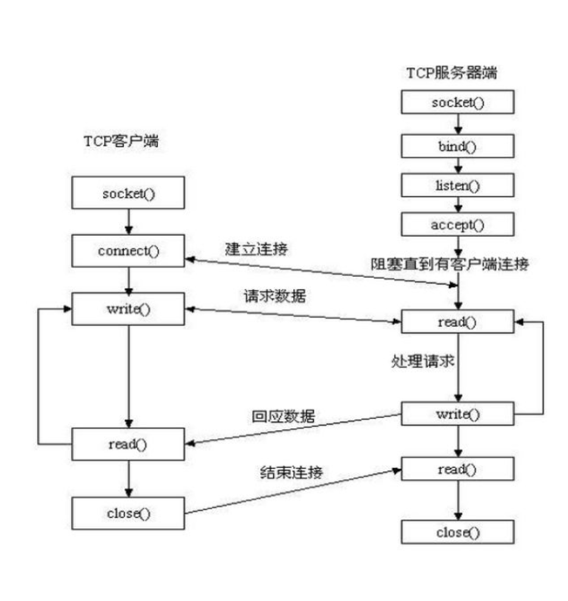
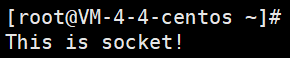

# socket介绍
Socket又称"套接字"，应用程序通常通过"套接字"向网络发出请求或者应答网络请求，使主机间或者一台计算机上的进程间可以通讯。

## socket操作
socket起源于Unix，而Unix/Linux 基本哲学之一就是“一切皆文件”，都可以用“打开open –> 读写write/read –> 关闭close”模式 来操作。Socket就是该模式的一个实现，socket即是一种特殊的文件，一些socket函数就是对其进行的操作（读/写IO、打开、关闭），所以socket只干两件事儿，接收数据和发送数据。
假如先在存在两台计算机需要通信，那么socket在这个通信过程是如何工作的呢？
1. 首先接受方绑定并监听一个端口，等待连接
2. 发送方根据接收方监听的端口和IP进行访问
3. 连接建立成功后，发送方发送信息
4. 接收方收到信息，进行处理和响应
5. 通信结束，断开连接，关闭socket

如下是在TCP中socket的工作示意图



## python的socket模块
接下来的socket相关内容，我们都是基于python的socket模块进行学习 
### socket函数
在python里，我们通过socket函数，来创建一个套接字
`socket.socket([family[, type[, proto]]])`
它的参数是：
1. family,套接字家族，可以是AF_UNIX 或者 AF_INET
   AF_UNIX：用于本机进程间通讯，为了保证程序安全，两个独立的程序(进程)间是不能互相访问彼此的内存的，但为了实现进程间的通讯，可以通过创建一个本地的socket来完成
   AF_INET：AF代表ADDRESS FAMILY(还有一直PROTOCOL FAMLIY，两者咋iwindows没区别，Unix下是有些区别的) ，该地址族就是 Internet 协议 v4 地址族
2. type,套接字类型可以根据是面向连接的还是非连接分为 `SOCK_STREAM` 或 `SOCK_DGRAM`
3. protocol: 一般不填默认为 0

### 常用方法
#### 服务端方法
1. s.bind() 用来绑定地址参数是一个元组(host,port)，其表示地址
2. s.listen() 开始 TCP 监听。backlog 指定在拒绝连接之前，操作系统可以挂起的最大连接数量。
3. s.accept() 被动接受TCP客户端连接,(阻塞式)等待连接的到来
#### 客户端方法
1. s.connect() 初始化连接，参数为地址，元组格式，连接失败会返回socket.error
2. s.connect_ex() connect()函数的扩展版本,出错时返回出错码,而不是抛出异常

#### 公用方法
1. s.recv() 接受TCP数据，以字符串返回，参数bufsize设置接收到最大数据量
2. s.send() 发送TCP数据，将bytes发送到连接的套接字，返回值是发送字节的数量
3. s.sendall 完整的发送TCP数据。将bytes发送到连接的套接字，返回None前会尝试发送所有数据，失败则抛出异常
4. s.recvfrom() 接收 UDP 数据，与 recv() 类似，但返回值是（data,address）。
5. s.sendto() 发送 UDP 数据，将数据发送到套接字，需要参数address，是形式为（ipaddr，port）的元组
6. s.close() 使用完，记得关闭socket
7. s.setsockopt(level,optname,value) 设置给定套接字选项的值。
8. s.getsockopt(level,optname\[.buflen\]) 返回套接字选项的值。
9. s.settimeout(timeout) 设置套接字操作的超时期，timeout是一个浮点数，单位是秒。值为None表示没有超时期。一般，超时期应该在刚创建套接字时设置，因为它们可能用于连接的操作（如connect()）
10. s.setblocking(flag) 如果flag为0，则将套接字设为非阻塞模式，否则将套接字设为阻塞模式（默认值）。非阻塞模式下，如果调用recv()没有发现任何数据，或send()调用无法立即发送数据，那么将引起socket.error异常。

在上述介绍的方法可以看出，客户端有connect()方法去连接服务端，然后可以利用send()去发送tcp数据，但sendto()方法使用前没有进行连接，而是数据传输的时候指定远程地址，这也就是我们之前讲到的，TCP是面向连接的，UDP是无连接的

python2中send，recv等操作可以直接传字符串，但python3中需要bytes类型，数据需要encode或者decode来操作

## 作业
写出一个客户端来接受服务端发送的数据
```python
# filename: server.py
import socket                   # 导入socket模块

s = socket.socket()             # 创建套接字
host = socket.gethostname()     # 获取本地主机名（也可以根据实际情况修改，例如server可以放在你的VPS上，这里就可以写你VPS的公网地址）
port = 37777
s.bind((host,port))             # 绑定地址，注意参数为元组

s.listen(5)                     # 开启监听，等待连接
while True:
	con,addr = s.accept()
	print("connected from",addr)# 显示客户端地址
	con.send(b"This is socket!")
	con.close()
```

运行效果应该如下

运行Client.py达成如下效果
