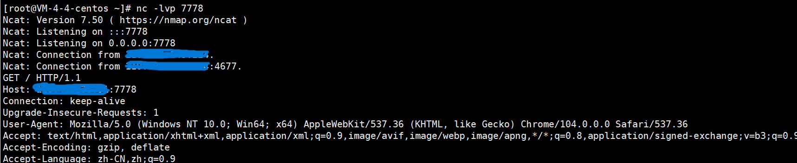
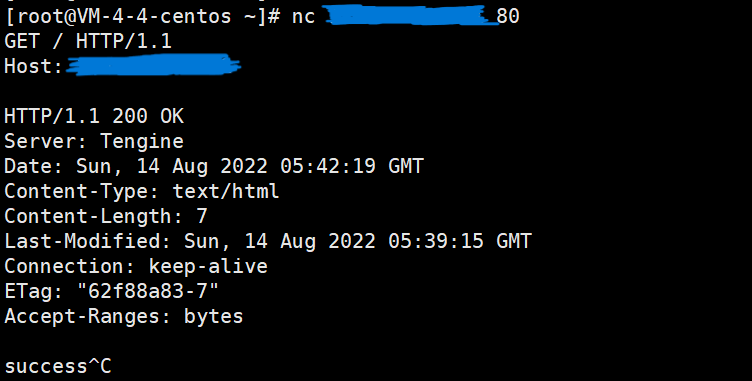
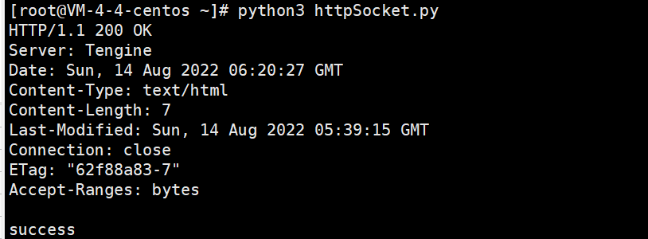
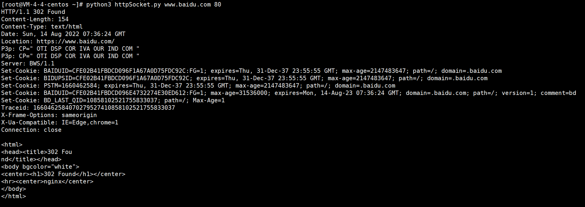

# 使用socket发送HTTP请求
## 理解HTTP请求的过程
在学习了前面的知识后，我们知道，HTTP的请求过程，就是把报文发送给了指定的服务。
我们先了解一下nc
### nc命令
**nc命令** 全称**netcat**，用于设置路由器。它能通过 TCP 和 UDP 在网络中读写数据。
语法如下
`nc [-hlnruz][-g<网关...>][-G<指向器数目>][-i<延迟秒数>][-o<输出文件>][-p<通信端口>] [-s<来源位址>][-v...][-w<超时秒数>][主机名称][通信端口...]`
#### 利用nc获取HTTP的请求
要使用nc获取http请求很简单，我们先准备一个虚拟机或者vps，然后安装好netcat
输入命令 `nc -lvp 7778`这样nc就会监听7778端口
然后我们在浏览器访问 ip:7778 (ip是你的vps或者虚拟机ip)
这样我们可以在nc看到来自浏览器访问的GET请求报文

#### 利用nc发送一个HTTP请求
nc可以连接一个远程地址，例如 `nc ip port`，然后输入内容，可以向远程地址发送数据

可以看到响应内容和浏览器访问是一样的


同理我们也可以用telnet去向一个web服务地址发送报文，相应的他们也会给我们返回响应报文

## socket发送HTTP请求
利用socket发送HTTP请求，其实就是向连接的远程端口发送一个HTTP请求报文
编写如下代码
```python
import socket
s=socket.socket(socket.AF_INET,socket.SOCK_STREAM) #创建套接字
s.connect(('127.0.0.1',80))                        # 连接WEB服务器
s.send(b'''GET / HTTP/1.1
Host: 127.0.0.1
Connection: close
Accept: text/html,application/xhtml+xml,application/xml;q=0.9,image/webp,*/*;q=0.8
Upgrade-Insecure-Requests: 1
User-Agent: Mozilla/5.0 (Windows NT 6.1; WOW64) AppleWebKit/537.36 (KHTML, like Gecko) Chrome/45.0.2454.101 Safari/537.36
Accept-Language: zh-CN,zh;q=0.8

''')                                               # 发送报文（注意格式）

buf=s.recv(1024)                                   # 接受响应信息
while len(buf):                                    # 判断长度，为0则接收完
    print(buf.decode())                            # 输出响应信息
    buf = s.recv(1024)
~                        
```
可以看到返回的报文，其中正文是"success"


## 作业
1. 利用socket写一个HTTP请求，用来完成攻防世界WEB新手区get post题目
2. 将上述脚本改写一个实现http请求函数，参数是请求的地址和端口，要求命令行调用可以实现请求任意地址的GET请求，实现效果如下
  
   PS：学习一下Python 命令行参数，其次需要注意的是，port是一个int类型的数字，而host是一个字符串。