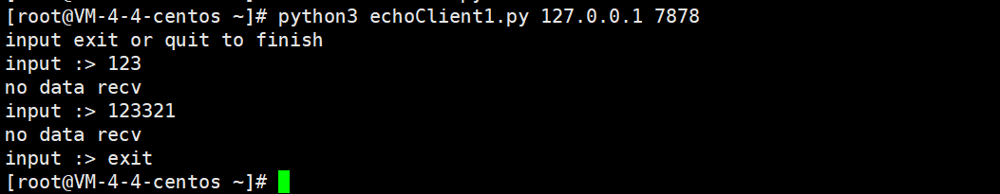
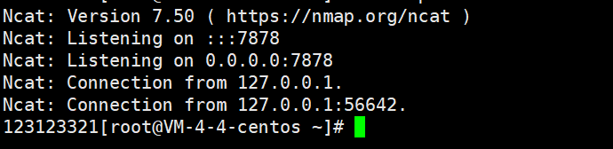
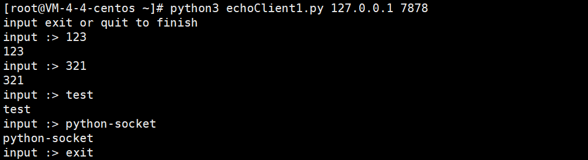

# 使用socket编写echo服务器
本节我们将编写一个简单的 echo 服务器。
## 什么是echo服务器
echo服务器，顾名思义就是将收到的客户端数据原封不动地传回客户端。类似我们之前提到TRACE的HTTP请求。并且echo服务器也是非常有用的进行调试和检测的工具。

## 客户端
首先我们要实现echo服务器，使client.py能够循环地接收用户输入。
那么客户端我们应该这样编写
```python
import socket
import sys
# 主机
HOST = sys.argv[1]
# 端口
PORT = int(sys.argv[2])
socket.setdefaulttimeout(3)                               # 设置超时

def echoClient():
    s = socket.socket(socket.AF_INET, socket.SOCK_STREAM) # 创建套接字
    s.connect((HOST, PORT))                               # 连接远程地址
    print("input exit or quit to finish")
    while True:
        data = input('input :> ')                         # 输入

        if data == 'exit' or data == 'quit':              # 判断是否退出
            break
            
        s.sendall(data.encode())                          #  发送数据
        
        try:
			data = s.recv(1024)                               # 接受数据
			print(data.decode('utf-8'))
		except Exception as e:
			print("no data recv")

    s.close()


if __name__ == '__main__':
    echoClient()
                
```
我们可以用nc监听一下7878端口，然后运行pyhon3 echoClient.py 127.0.0.1 7878

可以看到输入的123和123321


## 作业
根据上面的Client，写出对应的echo服务器(echoServer.py)，要求运行服务端，然后在运行客户端连接，输入与输出对应。
实现效果如下图
